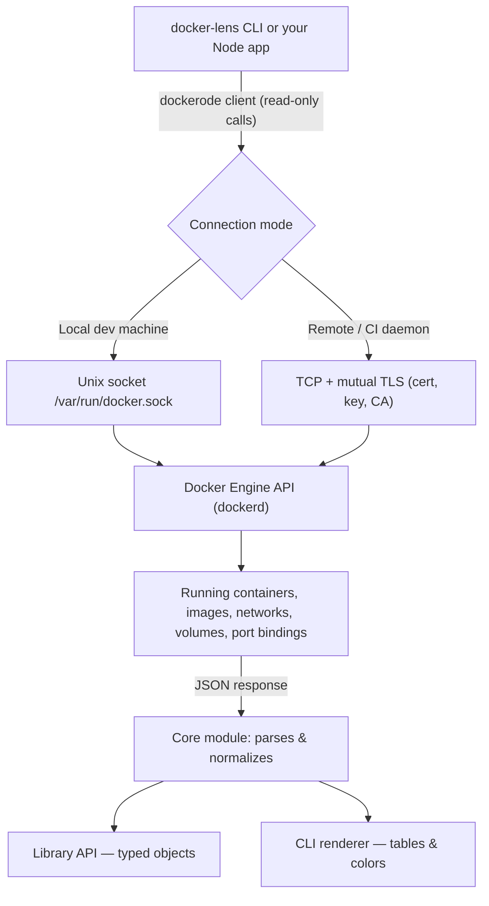

<p align="center">
  
</p>

<h1 align="center">docker-lens</h1>

<p align="center">
  A read-only Node.js SDK + CLI for introspecting running Docker containers, images,
  networks, and port mappings — no more piping five <code>docker</code> commands together.
</p>

<p align="center">
  
  
  
  
  
</p>

---

## Why docker-lens

Docker gives you plenty of raw commands (`docker ps`, `docker inspect`, `docker stats`)
but no single, readable view of *what's actually running and which ports it's using*.
docker-lens wraps the Docker Engine API and gives you that view — as a library you can
build on, or as a CLI dashboard you can just run.

- 🔍 **Port map at a glance** — see every host↔container port binding in one table
- ⚠️ **Port conflict detection** — flags clashing or stale port bindings
- 📦 **Container & image inventory** — status, size, uptime, dangling image cleanup report
- 📈 **Live stats** — streaming CPU/memory/network usage per container
- 🧩 **Use it as a library or a CLI** — same core, two ways to consume it
- 🔒 **Read-only by design** — v1 never starts, stops, or removes anything (see [Security](#security-model))

---

## Installation

```bash
# As a global CLI
npm install -g docker-lens

# As a project dependency (library usage)
npm install docker-lens

# Or run without installing
npx docker-lens
```

**Requirements:** Docker Engine running locally (or a reachable remote daemon), Node.js 18+.

---

## Quick start — CLI

```bash
# Full dashboard: containers, ports, live stats
docker-lens

# Just the port mapping table
docker-lens ports

# Highlight port conflicts only
docker-lens ports --conflicts

# Image inventory + dangling image report
docker-lens images --dangling
```

## Quick start — library

```ts
import { listContainers, getPortMap, findPortConflicts, streamStats } from "docker-lens";

const containers = await listContainers({ all: true });
const ports = await getPortMap();
const conflicts = await findPortConflicts();

for await (const stat of streamStats(containers[0].id)) {
  console.log(stat.cpuPercent, stat.memUsageMB);
}
```

---

## Commands reference

| Command | Description |
|---|---|
| `docker-lens` | Full live dashboard — containers, ports, stats, auto-refreshing |
| `docker-lens ps` | List containers (status, image, uptime, health) |
| `docker-lens ports` | Host↔container port mapping table |
| `docker-lens ports --conflicts` | Only show detected port conflicts |
| `docker-lens images` | List images (repo, tag, size, created) |
| `docker-lens images --dangling` | Report unused/dangling images (report only — no deletion) |
| `docker-lens stats <containerId>` | Live streaming CPU/memory/network for one container |
| `docker-lens networks` | List Docker networks |
| `docker-lens volumes` | List Docker volumes |
| `docker-lens --host <tcp://...>` | Connect to a remote daemon (use with `--tls-*` cert flags) |
| `docker-lens --help` | Full flag reference |

---

## Socket flow diagram

How a docker-lens command actually reaches Docker and gets back to your terminal:



- **Local mode** (default): talks over the Unix socket — this is local IPC, not network
  traffic, so there's nothing "in transit" to encrypt.
- **Remote mode**: uses Docker's native mutual TLS, not a custom encryption layer — see
  [Security Model](#security-model) for why.

---

## Folder structure

```
docker-lens/
├── assets/
│   └── logo.svg                # project mark
├── bin/
│   └── docker-lens.js          # CLI entrypoint (#!/usr/bin/env node)
├── src/
│   ├── core/
│   │   ├── dockerClient.ts     # dockerode init — local socket + remote TLS
│   │   ├── containers.ts       # listContainers, getContainerDetails
│   │   └── images.ts           # listImages, findDanglingImages
│   ├── ports/
│   │   ├── getPortMap.ts       # flattened host↔container port table
│   │   └── findConflicts.ts    # port conflict detection
│   ├── stats/
│   │   └── streamStats.ts      # live CPU/mem/network streaming
│   ├── cli/
│   │   ├── index.ts            # command parsing (commander)
│   │   └── render/             # table + color rendering helpers
│   └── index.ts                 # public library exports
├── test/                        # unit tests (mocked dockerode, no daemon required)
├── Jenkinsfile                  # CI/CD — lint, test, build, tag-gated publish
├── CLAUDE.md                    # project context & architecture notes
├── DEVELOPMENT.md                # phase-wise development plan
├── package.json
├── tsconfig.json
└── README.md
```

---

## Security model

v1 is **strictly read-only** — it never starts, stops, restarts, kills, or removes any
container, image, network, or volume. This is a deliberate v1 scope decision, not a
missing feature.

| Concern | How it's handled |
|---|---|
| Local Docker socket access | Requires the same OS-level permission as the `docker` CLI itself (membership in the `docker` group, or elevated privileges). This is a known Docker-wide behavior, not specific to docker-lens — being in the `docker` group is effectively root-equivalent. |
| Remote daemon connections | Uses Docker's native **mutual TLS** (`--tlsverify`, client cert, key, CA) — the same standard, audited mechanism Docker itself uses. docker-lens does not implement or rely on any custom encryption layer. |
| Data in transit (local) | Not applicable — the Unix socket is local IPC and never touches a network interface. |
| Malformed/malicious container metadata | All inspected data (labels, env vars, names) is sanitized before being rendered in the terminal or passed back through the library API. |
| Write/destructive actions | Not implemented in v1 at all. Planned as an explicit, opt-in, confirmation-gated feature in a future major version. |

---

## Roadmap

See [DEVELOPMENT.md](./DEVELOPMENT.md) for the full phase-by-phase plan. High level:

- ✅ Phase 1–4: Core SDK, port mapping, live stats, CLI dashboard
- ✅ Phase 5–6: npm publish, Jenkins CI/CD with tag-gated releases
- ⏭️ Phase 7+: local web dashboard, opt-in write actions, Compose-aware grouping

## Contributing

Issues and PRs welcome. Please read [CLAUDE.md](./CLAUDE.md) for the project's
architectural decisions and scope boundaries (especially the read-only constraint)
before proposing features that touch write/destructive Docker actions.

## License

MIT
